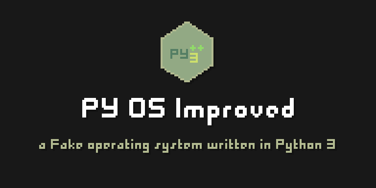

<div align="center">

# PY OS Improved 

### The Ultimate fake Operating System written in Python 3



</div>

## 目录

- [介绍](#介绍)
- [硬件需求](#硬件需求)
  - [最低配置](#最低配置)
  - [推荐配置](#推荐配置)
- [安装指南](#安装指南)
  - [安装 Python 3](#安装-python-3)
  - [自动安装](#自动安装)
  - [手动安装](#手动安装)
- [运行 PY OS Improved](#运行-py-os-improved)
- [常见问题](#常见问题)
- [功能列表](#功能列表)
- [鸣谢](#鸣谢)

## 介绍

PY OS Improved 是一款基于 Python 3 的"伪"操作系统，简称PYOSI。

> [!TIP]
> 本项目由主开发者 [minqwq](https://github.com/minqwq) 基于 [MPGA-PyOS](https://github.com/Meltide/mpga-pyos) 修改而来，并进行了大量改进。

## 硬件需求

### 最低配置

CPU：任何 x86/x86-64/arm/arm64 兼容的处理器

RAM：至少48MB

磁盘：至少剩余 150MiB

GPU：未指定

声卡：未指定

网卡：未指定

屏幕：未指定

<hr>

### 推荐配置

CPU：任何 **2007年以后的** 的 x86/x86-64/arm/arm64 兼容的处理器

RAM：至少128MB（建议256MB及以上）

磁盘：至少剩余 256MiB（建议512MB及以上）

GPU：集成显卡或独立显卡（建议显存128MB及以上）

声卡：集成声卡或独立声卡（建议比特率64kbps及以上）

网卡：集成网卡或独立网卡（建议网络速率10Mbps及以上）

屏幕：至少800x600@30hz（建议1024x768@60hz及以上）

## 安装指南

### 安装 Python 3

**For Windows**

前往 [Python 官网](https://www.python.org/downloads/) 或 [阿里云镜像源](https://mirrors.aliyun.com/python-release/) 下载安装包。

下载完成后直接安装即可。

> 注意：安装界面中，请勾选 `Add Python 3.x to PATH` 选项。

**For macOS**

使用 Homebrew 安装 Python：

``` bash
brew install python 
```

**For Linux**

请根据您的发行版的包管理器安装 Python。

Debian/Ubuntu：

``` bash
sudo apt-get install python3
```

CentOS/Fedora：

``` bash
sudo dnf install python3
```

Arch Linux：

``` bash
sudo pacman -S python
```

### 自动安装

您可以使用 PY OS Improved 的安装程序2.0来自动安装 PY OS Improved。

打开终端，输入以下命令：

``` bash
# For Linux/MacOS：假设下载后解压到 ~/Downloads/pyos-improved/
cd ~/Downloads/pyos-improved/

# For Windows：假设下载后解压到 D:\Downloads\pyos-improved\
cd D:\Downloads\pyos-improved\

# 运行安装程序
cd INSTALL
python installer_v2.0.py
```

随后，您只需要按照步骤进行安装依赖即可。

<hr>

### 手动安装

> [!WARNING]
> 如果您时新手，建议使用自动安装。否则手动安装对于您来说可能比较困难。

首先，使用 pip 安装模块。

``` bash
# For Windows
pip install -r requirements.txt
```

> [!NOTE]
> 如果您所在地区（例如中国大陆）连接到pip默认源网络不稳定，请尝试换源，例如 **清华大学镜像站**。

``` bash
# 首先临时使用清华源更新pip
python -m pip install -i https://mirrors.tuna.tsinghua.edu.cn/pypi/web/simple --upgrade pip
# 然后对pip换源
pip config set global.index-url https://mirrors.tuna.tsinghua.edu.cn/pypi/web/simple
```

安装模块之后，您需要区分Windows和Linux/MacOS，并按照以下步骤进行配置。

> [!TIP]
> "config/config.json" 是 PY OS Improved 的配置文件，当你第一次使用时，需要对其进行修改（只需少量更改）

打开它，找到一行包含 **"isWindows"** 的内容：

``` json
{
  "isWindows": false,
}
```

将其替换为 "false" 或 "true"（Windows改为true，Linux/MacOS改为false）。

如果你有虚拟环境，可以配置 "venvEnable" 和 "venvPath"，配置示例显示在配置文件中。

``` json
{
  "venvEnable": "true",
  "venvPath": "~/pyvenv/bin/python",
}
```

到这里，手动安装就完成了。

## 运行 PY OS Improved

运行 **PYOSI** 文件夹内的 **pyosimproved.py** 即可。

``` bash
cd PYOSI
python pyosimproved.py
```

> [!TIP]
> 如果仍然崩溃，请安装更多模块（跟踪信息会告诉你缺少什么）

## 常见问题

#### Q: 运行此项目是否需要 Windows 管理员权限？

#### A: 不需要。

<hr>

#### Q: 如果我使用 Linux 发行版，是否强制要求使用虚拟环境？

#### A: 不是，这取决于具体的发行版（例如 Debian 需要，但 Fedora 不需要）

<hr>

#### Q: 出现崩溃了！

#### A: 请打开问题报告，或者如果你能，自行修复 ;)

<hr>

## 功能列表

运行此程序，登录后，输入 help 并按回车。

``` bash
> help

# 输出：
"""
Larine Shell manual help:
(System)
ls                        View the path
about [-c | -s]           Show the system's information
pyosver                   Show system version
converter                 A tool to convert .lpap/.lpcu/.bbc to .umm
time                      Show the time and date(Deteled in this version)
calendar                  Show a calendar
clear                     Clear the screen
(DEL)passwd <str>         Change password for this session
power [shutdown | reboot] Power manager
exit                      Lock system
hostname [-c]             Show hostname
echo <str>                Print text to screen
flan <dir>                Remove file
......
"""
```

如果还有问题，请打开问题报告或发送邮件给主开发者 [minqwq](https://github.com/minqwq) ：minqwq723897@outlook.com

## 鸣谢

### 主开发者：[minqwq](https://github.com/minqwq) aka [minqwq723897](https://space.bilibili.com/1406220214)

- [bibimingming](https://github.com/bibimingming) aka [铭明-MM](https://space.bilibili.com/2053198592)
- [Meltide](https://github.com/Meltide) aka [-MeltIce](https://space.bilibili.com/57690791)
- [MinimalMio](https://github.com/MinimalMio) aka [北橋 桜](https://t.me/Kitahashi_Sakura) aka [high20212021](https://github.com/high20212021)
- [wusheng233](https://github.com/wusheng233github) aka [无声胡萝北](https://space.bilibili.com/1231550671)
- [ElofHew](https://github.com/ElofHew) aka [Dan_Evan](https://space.bilibili.com/642688364) aka [Dr.Evan](https://qm.qq.com/q/BPdpfotZgQ)

<hr>
<p align="center">—— PY OS Improved 项目组 ——</p>
<p align="center">—— 2025.05.02 ——</p>